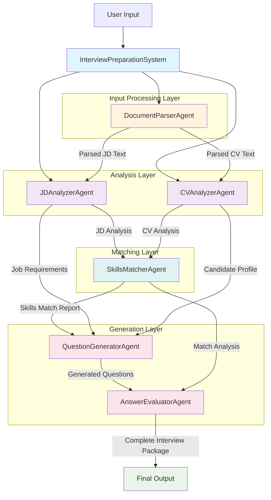

# Interview Preparation Agentic System

A multi-agent system built with Strands Agents framework that helps interviewers prepare for candidate interviews by analyzing job descriptions, CVs, and generating tailored interview questions with evaluation criteria.

## Features

- **Document Processing**: Parse PDF, DOCX files or accept direct text input
- **Intelligent Analysis**: Analyze job descriptions and candidate CVs using AI
- **Skills Matching**: Compare candidate skills against job requirements
- **Question Generation**: Generate level and round-specific interview questions
- **Evaluation Criteria**: Provide expected answers and scoring rubrics
- **Multi-Level Support**: Junior, Mid, Senior, Lead, and Principal levels
- **Interview Rounds**: Screening, Technical, Behavioral, and Final rounds
- **Interview Personas**: Friendly, Serious, Analytical, Collaborative, Challenging

## Architecture

The system uses a **multi-agent architecture** built on the Strands Agents framework, where specialized agents work together in a coordinated pipeline to prepare comprehensive interview materials.

### System Architecture Diagram



### Agent Responsibilities

#### 1. **InterviewPreparationSystem** (Main Orchestrator)
- **Purpose**: Central coordinator that manages the entire interview preparation workflow
- **Responsibilities**:
  - Orchestrates agent execution sequence using agent graph
  - Manages data flow between agents
  - Handles input validation and parameter processing
  - Aggregates results from all agents into final output
  - Provides error handling and recovery mechanisms
- **Input**: Job description, CV, role parameters, interview settings
- **Output**: Complete interview preparation package

#### 2. **DocumentParserAgent** (Input Processing Layer)
- **Purpose**: Handles document processing and text extraction from various formats
- **Responsibilities**:
  - Parse PDF and DOCX files
  - Extract clean text content
  - Handle direct text input
  - Normalize text formatting
  - Validate document structure and content
- **Input**: File paths or direct text (JD and CV)
- **Output**: Clean, structured text content
- **Technologies**: PyPDF2, python-docx, text preprocessing

#### 3. **JDAnalyzerAgent** (Analysis Layer)
- **Purpose**: Analyzes job descriptions to extract structured requirements and competencies
- **Responsibilities**:
  - Extract required and preferred technical skills
  - Identify soft skills and behavioral requirements
  - Determine experience level expectations
  - Parse role-specific competencies
  - Extract company culture and values
  - Identify key responsibilities and growth opportunities
- **Input**: Parsed job description text
- **Output**: Structured JD analysis with categorized requirements
- **AI Focus**: NLP for requirement extraction, skill categorization

#### 4. **CVAnalyzerAgent** (Analysis Layer)
- **Purpose**: Analyzes candidate CVs to extract skills, experience, and qualifications
- **Responsibilities**:
  - Extract technical skills and proficiency levels
  - Calculate years of experience per technology/domain
  - Identify leadership and management experience
  - Parse education background and certifications
  - Extract project experience and achievements
  - Analyze career progression and growth trajectory
- **Input**: Parsed CV text
- **Output**: Structured candidate profile with skills matrix
- **AI Focus**: Entity recognition, experience quantification, skill assessment

#### 5. **SkillsMatcherAgent** (Matching Layer)
- **Purpose**: Performs intelligent matching between job requirements and candidate qualifications
- **Responsibilities**:
  - Match technical skills with proficiency scoring
  - Identify skill gaps and missing requirements
  - Calculate overall compatibility score
  - Assess experience level alignment
  - Highlight candidate strengths and differentiators
  - Generate recommendations for skill development
- **Input**: JD analysis + CV analysis
- **Output**: Comprehensive skills matching report with scores
- **AI Focus**: Semantic matching, scoring algorithms, gap analysis

#### 6. **QuestionGeneratorAgent** (Generation Layer)
- **Purpose**: Generates tailored interview questions based on role, level, and candidate profile
- **Responsibilities**:
  - Create level-appropriate questions (Junior to Principal)
  - Generate round-specific questions (Screening, Technical, Behavioral, Final)
  - Adapt questions to interview persona (Friendly, Analytical, etc.)
  - Focus on skill gaps and strengths identified in matching
  - Include scenario-based and practical questions
  - Ensure question diversity and comprehensive coverage
- **Input**: Skills matching report + role parameters + interview settings
- **Output**: Categorized set of interview questions
- **AI Focus**: Question generation, difficulty calibration, persona adaptation

#### 7. **AnswerEvaluatorAgent** (Generation Layer)
- **Purpose**: Creates evaluation criteria and expected answers for generated questions
- **Responsibilities**:
  - Develop expected answer frameworks
  - Create scoring rubrics and evaluation criteria
  - Define red flags and positive indicators
  - Generate follow-up question suggestions
  - Provide interviewer guidance and tips
  - Create competency-based assessment matrices
- **Input**: Generated questions + candidate profile + role requirements
- **Output**: Complete evaluation framework with scoring guides
- **AI Focus**: Answer modeling, rubric generation, assessment criteria

### Data Flow Architecture

1. **Input Stage**: User provides JD, CV, and interview parameters
2. **Parsing Stage**: Documents are processed and text is extracted
3. **Analysis Stage**: Parallel analysis of JD and CV content
4. **Matching Stage**: Skills and requirements are matched and scored
5. **Generation Stage**: Questions and evaluation criteria are created
6. **Output Stage**: Complete interview package is assembled and returned

### Key Architectural Benefits

- **Modularity**: Each agent can be developed, tested, and maintained independently
- **Scalability**: Agents can be scaled individually based on processing needs
- **Flexibility**: Easy to add new agents or modify existing ones
- **Reusability**: Agents can be reused across different interview scenarios
- **Maintainability**: Clear separation of concerns makes debugging and updates easier
- **Extensibility**: New features can be added by introducing new agents or enhancing existing ones

## Installation

1. Clone the repository:
```bash
git clone <repository-url>
cd interview_agent
```

2. Install dependencies:
```bash
pip install -r requirements.txt
```

3. Configure environment variables in `.env`:
```bash
MODEL_ID=us.anthropic.claude-3-7-sonnet-20250219-v1:0
REGION=us-west-2
AWS_PROFILE=default
LOG_LEVEL=INFO
```

## Usage

### Basic Usage

```python
import asyncio
from agents import InterviewPreparationSystem

async def main():
    system = InterviewPreparationSystem()
    
    result = await system.prepare_interview(
        jd="Software Engineer position requiring Python and React skills...",
        cv="5 years experience in full-stack development...",
        role="Software Engineer",
        level="Senior",
        round_number=2,  # Technical round
        interview_persona="Analytical"
    )
    
    print(f"Generated {result['interview_preparation']['total_questions']} questions")

asyncio.run(main())
```

### File Input Support

```python
# Using file paths
result = await system.prepare_interview(
    jd="/path/to/job_description.pdf",
    cv="/path/to/candidate_cv.docx",
    role="Data Scientist",
    level="Mid",
    round_number=1,
    interview_persona="Friendly"
)
```

### Experience Levels

- **Junior**: Focus on fundamentals, learning ability, potential
- **Mid**: Balance technical depth with practical experience
- **Senior**: Advanced concepts, leadership scenarios, architecture
- **Lead**: Team leadership, mentoring, strategic thinking
- **Principal**: Vision setting, technical strategy, organizational impact

### Interview Rounds

1. **Screening**: Basic qualifications, cultural fit, motivation
2. **Technical**: Deep technical skills, problem-solving, coding
3. **Behavioral**: STAR method, leadership, team dynamics
4. **Final**: Strategic thinking, long-term vision, final assessment

### Interview Personas

- **Friendly**: Warm, encouraging, supportive tone
- **Serious**: Professional, direct, competency-focused
- **Analytical**: Detail-oriented, probing, deep understanding
- **Collaborative**: Team-focused, partnership emphasis
- **Challenging**: Boundary-pushing, resilience testing

## Running Examples

Run the comprehensive examples:

```bash
python example.py
```

Run the main application:

```bash
python main.py
```

## Output Structure

The system returns a comprehensive analysis including:

```json
{
  "metadata": {
    "role": "Software Engineer",
    "level": "Senior",
    "round_number": 2,
    "round_name": "Technical",
    "interview_persona": "Analytical"
  },
  "analysis_results": {
    "jd_analysis": {
      "required_skills": [...],
      "preferred_skills": [...],
      "level_competencies": [...]
    },
    "cv_analysis": {
      "technical_skills": [...],
      "years_of_experience": 8,
      "leadership_experience": [...]
    },
    "skills_matching": {
      "matched_skills": [...],
      "missing_skills": [...],
      "overall_match_score": 85
    }
  },
  "interview_preparation": {
    "questions": [...],
    "total_questions": 10,
    "evaluation_criteria": [...]
  }
}
```

## Performance

- CV analysis: ~30 seconds
- Question generation: ~45 seconds
- Supports concurrent processing
- Optimized for AWS Lambda deployment

## Error Handling

The system includes comprehensive error handling for:

- Missing environment variables
- File not found errors
- Invalid input formats
- API authentication errors
- Timeout scenarios
- Invalid parameter validation

## Testing

Run unit tests:

```bash
python -m pytest tests/
```

## AWS Deployment

The system is designed for AWS Lambda deployment:

1. Package the application
2. Configure IAM roles for Bedrock access
3. Set environment variables
4. Deploy using AWS SAM or CDK

## Contributing

1. Fork the repository
2. Create a feature branch
3. Make changes with tests
4. Submit a pull request

## License

MIT License - see LICENSE file for details.

## Support

For issues and questions:
- Create an issue in the repository
- Check the documentation
- Review the example code

## Changelog

### v1.0.0
- Initial release
- Multi-agent architecture
- Support for all experience levels and interview rounds
- File and text input processing
- Comprehensive evaluation criteria